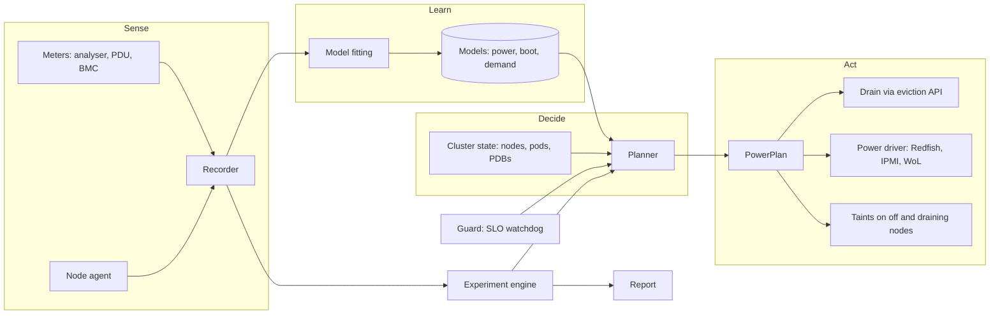

# Architecture

Status: draft v0, 2026-09-26.

## Goal

Reduce the electrical energy a Kubernetes cluster draws at the wall, on hardware whose power bill
the operator pays, without making the workloads' service levels worse. Prove the reduction with
measurements that a sceptical engineer can re-run.

Three consequences follow, and every design choice below serves one of them:

1. **The unit is kWh at the wall.** Not estimated watts, not PUE, not an "energy score".
2. **A saving counts only if it is measured against a counterfactual** in a randomised experiment
   with service levels held.
3. **The system must be safe in someone else's production cluster.** If it fails, the cluster
   behaves like stock Kubernetes.

## Where the energy goes

A server's power draw is roughly `P = P_idle + P_dynamic(load, frequency, ...)`. `P_idle` is
large: a powered, empty server draws a substantial share of its peak power. A server that is
powered off draws only its management controller's standby power, a few watts.

So the largest lever on most clusters is **how many servers are powered**, not where a pod lands.

| Lever | Mechanism | What it saves | Phase |
|---|---|---|---|
| Node power state | Drain spare capacity, power nodes off, power on ahead of demand | The idle power of every node that is off | v0.1 |
| Node choice | Keep the most efficient nodes on; switch the least efficient off first | The efficiency gap between hardware generations | v0.1 |
| CPU power settings | Energy-performance preference, governor, C-state limits per node class | Idle and dynamic power | v0.3 |
| Diurnal rightsizing | Lower CPU requests where and when usage is predictably low (in-place pod resize); memory stays at observed peak | Nothing directly; it frees capacity so more nodes can be off at night | v0.2, opt-in per workload |
| GPU clocks | Lock clocks per workload class | GPU dynamic power | v0.4 |
| Placement | Energy-marginal scoring among powered nodes | A few percent, on mixed hardware only | later |
| Time shifting | Run deferrable batch when power is cheap or low-carbon | Cost and CO2, not kWh | later |

Powering a node off pays only if it stays off long enough. The break-even time is

```
t_break_even = (E_shutdown + E_boot) / (P_idle - P_off)
```

Example: a boot that takes 5 minutes at 200 W costs 60 kJ. With 120 W idle and 10 W off, the
node must stay off for about 9 minutes before switching it saves anything. Wattproof measures these
quantities per node instead of assuming them.

## Daily cycles

Kubernetes places pods by their **requests** (reservations), not by their use. An online shop's
pods keep their reservations at night even when they are nearly idle. So nothing can be
consolidated unless the reservations shrink. There are three ways, in order of safety:

1. **Fewer replicas at night.** A HorizontalPodAutoscaler or KEDA scales the service down. Fewer
   pods leave nodes empty, and Wattproof powers them off. This is standard, safe, and what v0.1
   relies on. For clusters without autoscaling, the Observe report shows what enabling it would
   save.
2. **Smaller CPU requests at night.** In-place pod resize has been GA since Kubernetes 1.35, so
   requests can change without restarting pods. Wattproof learns each workload's usage by hour of
   week. It lowers CPU requests to a high quantile of the usage seen at that hour, plus a margin,
   and raises them before the morning ramp. More pods then fit per node, and more nodes can be off.
   This is v0.2, opt-in per workload, because requests belong to the application team
   ([ADR-0010](adr/0010-diurnal-overcommit-cpu-only.md)).
3. **Batch in the slack.** Batch jobs run in capacity that services reserve but do not use, instead
   of on nodes of their own. Koordinator does this already; integrate rather than rebuild.

**The asymmetry that sets the rules: CPU contention degrades, memory contention kills.** Too
little CPU makes pods slower, which is visible within seconds and reversible by resizing up. Too
little memory kills pods. So Wattproof overcommits CPU from forecasts but keeps memory requests at the
observed peak plus a margin.

Guards specific to this lever:

- node CPU pressure (PSI) and pod throttling, on top of the service-level indicators;
- on a breach, resize up within seconds, then power on a node, which takes minutes;
- headroom sized to cover forecast growth over one boot time at a high quantile;
- an operator calendar for known events (sales, campaigns) that suspends overcommit.

Excluded:

- workloads with less than about four weeks of history;
- workloads with bursty, unpredictable demand;
- workloads with strict tail-latency contracts;
- memory-heavy caches whose heaps do not shrink;
- pods with node-local volumes.

## Principles

1. **Measure before optimising.** Every number carries its measurement class
   ([measurement.md](measurement.md)).
2. **Learn the physics, then optimise.** Models of power, boot time and demand are learned
   continuously. Decisions are computed from those models by an optimiser that can state why it
   acted. No learned end-to-end policy until a simpler one has been measured and beaten
   ([ADR-0003](adr/0003-models-then-optimiser.md)).
3. **Use Kubernetes' own mechanisms first.** Taints, the eviction API, PodDisruptionBudgets.
   v0.1 changes no scheduler configuration ([ADR-0005](adr/0005-no-scheduler-change-in-v01.md)).
4. **Fail neutral.** If Wattproof stops, powered nodes stay powered and pods schedule as usual.
5. **Staged autonomy.** Observe, then recommend, then act.
6. **Nothing leaves the cluster by default** ([ADR-0007](adr/0007-no-egress-by-default.md)).
7. **Every action is recorded** with its reason and its predicted effect.

## Overview



## Components

### Meters

A `MeterDriver` interface with one implementation per device family:

- Reference power analyser over SCPI (Yokogawa WT300E series, ZES LMG, Hioki PW33xx).
- Outlet-metered PDU over SNMP or HTTP (Raritan PX3 first).
- BMC over Redfish, with IPMI DCMI as fallback.

Each driver returns timestamped samples with a quality class. Energy counters are preferred to
integrating sampled power. A `PowerMeter` resource maps outlets to nodes. A server with two power
supplies has two outlets, and both are summed.

### Node agent

A DaemonSet with read-only access to `/proc` and `/sys`. It samples per-core utilisation,
frequency, C-state residency, RAPL counters and temperatures at 1 Hz. These are model features,
never totals. In v0.3 it gains an opt-in, privileged mode that applies CPU power settings.

### Recorder

Writes all samples to two places: Prometheus metrics for operations, and immutable Parquet files
for experiments and published data. It flags gaps and never interpolates across them.

It also reports Wattproof's own consumption, estimated from its CPU share of the nodes it runs on.
A tool that saves energy should show what it costs.

### Models

All models are small, inspectable and versioned. Each is stored in the status of a Kubernetes
resource, so an operator can read what the system believes.

- **Node power model.** Wall power as a function of utilisation, frequency and temperature,
  fitted per node. Nodes of the same hardware class share a prior, so a new node is useful before
  it has its own data. Passive fitting from normal load comes first. An optional active
  calibration run in a quiet window follows.
- **Transition model.** Per node: boot time until the node is Ready, and the energy of shutdown
  and boot. Measured on every power cycle.
- **Demand forecast.** Requested CPU and memory, for the cluster and per workload, as quantiles
  over the next planning horizon. Hour-of-week seasonality plus recent level.

Refitting runs on a schedule and on drift. Drift means the power model's residuals leave their
control band, for example after a firmware change. A new model version goes live only if it
beats the current one on held-out data.

### Planner

Runs every control cycle (default 1 minute, planning horizon 30 minutes). It chooses the set of
powered nodes that minimises predicted energy, subject to:

- powered capacity covering the forecast demand quantile plus headroom, over the next boot time;
- every pod on a node to be switched off being re-placeable, checked with a scheduling
  simulation, and its PodDisruptionBudget allowing eviction;
- expected off-time exceeding the node's break-even time plus a margin (hysteresis);
- hard limits from `EnergyPolicy` (minimum powered nodes, maximum concurrent transitions,
  protected nodes).

A greedy rule is enough to start: rank nodes by predicted energy per unit of capacity and keep
the best-ranked ones on until capacity is covered. The output is a `PowerPlan` listing each step,
its reason and its predicted saving.

### Actuators

- **Taints.** A node that is draining or off carries `NoSchedule` taints, so the stock scheduler
  spreads new pods only across the powered set. Restricting which nodes are schedulable is what
  consolidates the cluster.
- **Drain.** Through the eviction API only, which respects PodDisruptionBudgets.
- **Power driver.** Redfish `ComputerSystem.Reset` (graceful shutdown, on), IPMI, or Wake-on-LAN.
  In clouds and virtualised clusters, the same interface maps to the provider's API or Cluster
  API machines.
- **Node tuning** (v0.3). CPU power settings through the agent.

### Resize controller (v0.2, built alongside v0.1)

Lowers and raises the CPU requests of running pods through the `pods/resize` subresource
(in-place pod resize, GA in Kubernetes 1.35). It follows each workload's learned hour-of-week
usage ([ADR-0010](adr/0010-diurnal-overcommit-cpu-only.md)).

A pod is eligible only if all of these hold:

- Its workload opts in with the annotation `energy.wattproof.io/resize: "cpu"`.
- Its QoS class is Burstable. Guaranteed pods are excluded, because their CPU request must equal
  their limit, so lowering one caps the other.
- No VerticalPodAutoscaler manages it.
- If a HorizontalPodAutoscaler scales it on CPU, the target type is `AverageValue` (absolute
  millicores), not `Utilization`. Utilization is measured against the request, so lowering the
  request would make the autoscaler see higher utilization and add replicas, undoing the saving.
  Workloads that fail this check appear in the report with the reason.
- Its workload has at least four weeks of usage history.

The target, per workload and hour of week, is a high quantile of per-pod CPU usage plus a margin,
never below a floor. New pods start with the template's requests and are resized only after a
warm-up (default 5 minutes), because many runtimes need CPU at start.

The order of operations matters:

- **Evening.** Resize down first. The planner then sees fewer requested cores, drains nodes and
  powers them off.
- **Morning.** Power on first. Raising requests on a full node fails: the kubelet reports the
  resize as deferred or infeasible. So nodes must be Ready before requests go up. Then resize up.
  Pods whose resize is still deferred are evicted to the new nodes within their
  PodDisruptionBudget. The lead time is boot time plus drain time, so the demand forecast must see
  the ramp that far ahead.

A resize stuck in `PodResizePending` longer than a set time counts as a guard signal. Memory
requests are never changed. The controller needs `patch` on `pods/resize` and nothing more on
pods.

### Guard

Watches service-level indicators that the operator defines as `ServiceLevel` resources (PromQL
with a threshold), plus built-in ones: pod pending time and pod start latency. On a breach it
freezes the plan, powers on reserve nodes and raises an alert. It runs in the same process as the
planner but in its own goroutine, with no dependency on the models.

### Experiment engine

Runs policy experiments and records every block:

- **Lab:** crossover and switchback designs across arms (stock, tuned open source, Wattproof).
- **Production:** a small holdout. A comparison with last month proves nothing: traffic, services
  and weather all change. So Wattproof steps aside in a random share of time slots (for example one
  in ten), and the cluster runs as it did before Wattproof. Energy per unit of load in those slots,
  compared with Wattproof's slots in the same weeks, is the measured saving. Both kinds of slot see
  the same month's traffic, randomly interleaved, so "the load changed" cannot explain the
  difference. The customer gives up the saving during holdout slots: that is the price of proof.
  These numbers are what a success-fee contract bills against. Customers who refuse a holdout get
  a model-based estimate, labelled as such.

Later, the same engine tunes the planner's own parameters: headroom quantile, hysteresis
margins. It runs safe experiments and keeps what saves energy without worse service levels.
This is where "improves itself" lives. Models retrain continuously, but a policy changes only
after it has won an experiment.

### Intent (optional, later)

An `IntentClassifier` interface answers "what is this workload, and what may we do with it?":
latency-critical, interactive, batch, deferrable; safe to evict now; tolerance for lower CPU
frequency. Implementations, in order: pod annotations, rules, then an external model such as
TypeSafe's Jev. The external model is off by default because it needs egress. It is called once
per workload template and cached, and acts only above a confidence threshold.

## Kubernetes API

Group `energy.wattproof.io/v1alpha1`.

| Kind | Scope | Purpose |
|---|---|---|
| `EnergyPolicy` | Cluster, singleton | Mode (Observe, Recommend, Act), limits, protected nodes, headroom, holdout share, kill switch |
| `PowerMeter` | Cluster | Driver, endpoint, credentials secret, class, outlet-to-node mapping |
| `NodePowerModel` | Cluster, one per node | Status only: model version, coefficients, fit quality, training window, meter class |
| `PowerPlan` | Cluster | Planned steps with reasons and predictions; approval state in Recommend mode |
| `ServiceLevel` | Namespaced | SLI query, threshold, window |
| `Experiment` | Cluster | Arms, block length, randomisation seed, schedule, status |

## Autonomy modes

- **Observe.** Fit models and compute plans; act on nothing. Report what would have been done and
  the model-estimated saving, labelled as an estimate.
- **Recommend.** Plans wait for approval (`kubectl annotate` or the UI).
- **Act.** Plans execute within `EnergyPolicy` limits.

Observe mode is not a separate product. The models need to watch the cluster before they can act,
so this mode exists from the first version.

## Invariants

Each of these has a test that can fail.

1. Never power off a node with a pod that cannot be evicted: its PodDisruptionBudget would be
   violated, it has no controller, it uses node-local storage, or it is annotated
   `energy.wattproof.io/protect`.
2. Never power off control-plane nodes or nodes matching the protected selector.
3. Never fewer powered nodes than the minimum; never more concurrent transitions than the maximum.
4. If meters or models are stale, start no new power-off. Pending power-ons still complete.
5. If the guard trips: power on the reserve, freeze the plan, alert.
6. Pods that fit no powered node trigger a power-on within one control cycle.
7. The kill switch powers on all nodes and stops all actions within one control cycle.
8. No outbound connections except to configured meters and BMCs.
9. The kill switch, or uninstalling Wattproof, starts restoring every resized pod to its template
   requests within one control cycle, powering on nodes first where the pods would not fit.

## Deployment

One Helm chart:

- a controller Deployment (two replicas, leader election) holding the recorder, models, planner,
  guard and experiment engine;
- the agent DaemonSet;
- the CRDs.

Each component has its own least-privilege RBAC. BMC and meter credentials live in Secrets and
work with External Secrets. There is no custom scheduler in v0.1.

Language: Go for everything that runs in the cluster, built on controller-runtime. Offline
analysis for published reports uses Python in `analysis/`, so reviewers can re-run it with
standard tools ([ADR-0006](adr/0006-go-runtime-python-analysis.md)).

## Carried over from earlier research prototypes

Ideas only. No code.

- Measure at the wall, per node, with hardware meters.
- Power curves are non-linear and differ per node; measure them.
- Never make scheduling wait on a network call; degrade to neutral.
- Compare against stock Kubernetes with identical workloads.

## Rejected approaches

| Approach | Why rejected |
|---|---|
| Learned end-to-end placement policy (deep RL) | When the energy function is known, a one-step placement is an argmin and needs no learning. Learning belongs in the models. |
| Model inputs sized to a fixed node count | Breaks when the cluster grows or shrinks. |
| Assumed (synthetic) power curves | Measured curves are the point. |
| Capacity-only node state | Decisions need current use, not allocatable capacity. |
| Savings reported against the worst possible node | That comparison proves nothing. Baselines are stock and tuned-stock Kubernetes. |
| Stress-only test workloads | They have no service level, so they cannot show that nothing got worse. |
| Custom scheduler as the first lever | Intrusive to install and the smaller lever. |

## Open questions

- Suspend-to-RAM on servers: support is rare, but it would shorten boot time and change break-even
  times. Check the testbed hardware.
- How often can a server be power-cycled without concern for wear? Record cycles and publish them.
- Stateful workloads with node-local volumes: exclude in v0.1, revisit later.
